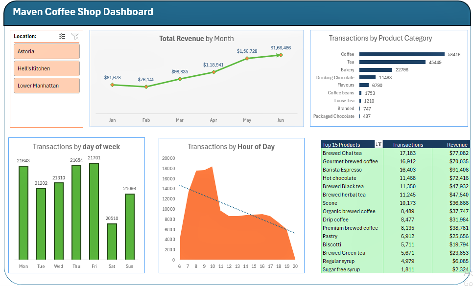
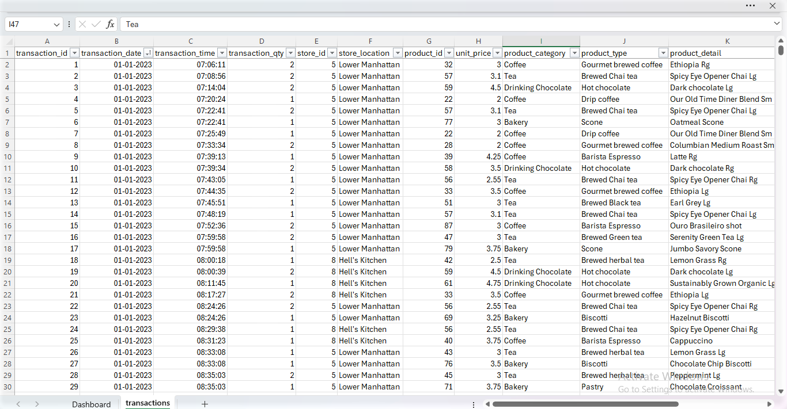
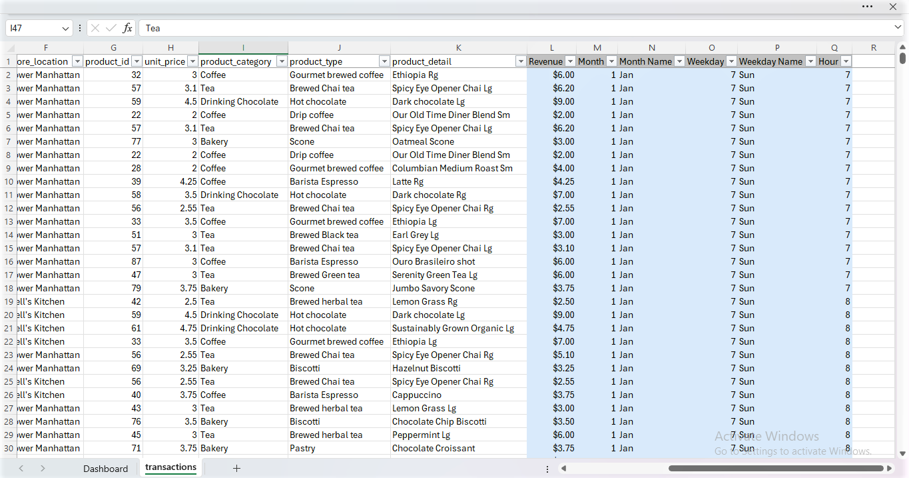
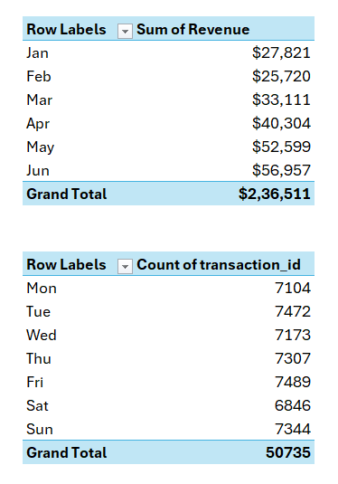
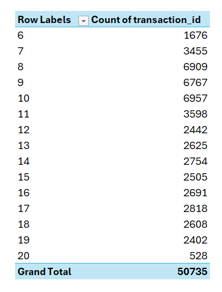
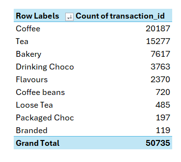

# Maven Coffee Shop Sales
---
The Maven Coffee Shop sales data Excel dashboard provides a visual representation of key sales performance indicators, enabling quick analysis and informed decision-making. It offers a comprehensive overview of sales trends, product popularity, customer behavior, and overall shop performance.

## The Assignment
Maven Roasters is a coffee shop chain with three locations in New York City. To better understand the purchase behavior and streamline operations, I have collected transactional data from Jan-Jun 2023. My goal is to transform the data into a dynamic dashboard that franchise owners can use to identify patterns, trends and opportunities for the business.
---
## The Objectives
1. Profile and prepare the raw data for analysis
2. Explore the data with Excel Pivot Tables
3. Build a dynamic dashboard to visualize patterns and trends
---
### Objective 1: Prepare the raw data for analysis
✅ Add a new column to calculate **Revenue** (price * quantity)
✅ Add new columns to calculate **Month** and **Day of Week** based on the transaction date
✅ Add a new column to extract **Hour** from the transaction time

---

### Objective 2: Explore the data with Excel Pivot Tables
✅ Insert PivotTable on a new tab to show revenue by month
✅ Add two more PivotTables to show the **number of transactions** by **day of week** and by **hour of day**
✅ Add PivotTable to show the **number of transactions** by **product category**, stored descending by transactions
✅ Add PivotTable to show the **number of transactions** and **revenue** by **product type**, sorted descending and filtered to the Top 15 (by transactions)

 

 

---
### Objective 3: Build a dynamic dashboard
✅ Add Pivot Charts to show revenue, transaction by product category, transaction byday of the week, transaction by hour of a day using **line chart, column chart, bar charts etc**
✅ Assemble the charts into a rough dashboard layout, and include space for the PivotTable showing **Top 15** product types
✅ add a **slicer** for **store location**, and connect it to all the PivotTable on the sheet

## Maven Coffee Shop Sales Dashboard

---

© 2024 Abhishek J Project Portfolio.
